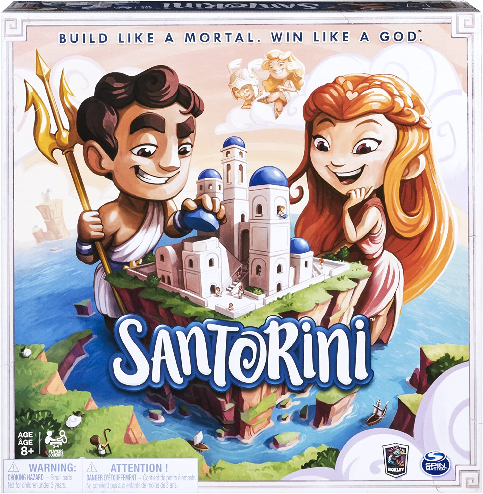

# Software Engineering Final Project – Academic Year 2019–2020


This project consists in the development of a distributed software version of the board game [Santorini](http://www.craniocreations.it/prodotto/santorini/). 
The application follows the Model–View–Controller (MVC) architectural pattern.
It is composed by a **server**, which accepts client connections and manages the game flow, and a **client**, available both as a CLI and a GUI implemented using JavaFX.

## Project Documentation

### UML Diagrams

Below are links to the UML diagrams created during development, including initial high-level diagrams and final diagrams generated automatically using dedicated tools:

- [Initial UML diagrams](https://github.com/gabrielepagano/ing-sw-2020-Pagano-Somaschini-Tegli/tree/master/deliverables/UML/Initial)
- [High-level UML diagrams](https://github.com/gabrielepagano/ing-sw-2020-Pagano-Somaschini-Tegli/tree/master/deliverables/UML/High%20Level)
- [Final UML diagrams](https://github.com/gabrielepagano/ing-sw-2020-Pagano-Somaschini-Tegli/tree/master/deliverables/UML/Final)

### Libraries Used
|Library|Description|
|---------------|-----------|
|__JUnit__|Java framework for unit testing|
|__Maven__|Build automation and dependency management tool|
|__JavaFX__|Java graphical library|

### JavaDoc
The source code has been documented following the Javadoc standard. The generated documentation is available [here](https://github.com/gabrielepagano/ing-sw-2020-Pagano-Somaschini-Tegli/tree/master/docs)

### JAR Files

The following executable JARs have been produced:
- one executable JAR for the server
- one executable JAR for the client on Windows
- one executable JAR for the client on Unix-like systems

All JAR files can be found [here](https://github.com/gabrielepagano/ing-sw-2020-Pagano-Somaschini-Tegli/tree/master/deliverables/jars)

## Features
### Implemented Features
- Complete game rules
- CLI
- GUI
- Socket-based networking
- 2 Advanced Features

### Advanced Features
- Multiple concurrent games
- Advanced God powers


As a minor extension to the original specification, client disconnections (except during the initialization phase) are interpreted as a loss rather than causing the match to terminate.

For example, in a three-player game, if one player disconnects, the game continues and the disconnected player is simply declared defeated.

## Running the JAR Files

### Client

*The client behaves identically on Windows and Unix-like systems.*

The client JAR accepts the following command-line arguments:
- user interface type (CLI or GUI)
- server IP address
- server port number

The UI type is **mandatory** and must be specified as "cli" or "gui" (case-insensitive) immediately after the JAR name.

The IP address and port number are optional; if omitted, the following default values are used:
- IP address: *localhost*
- port: *12345*

A running server at the specified address and port is **required** for the client to start.

#### CLI
For an optimal command-line experience, it is recommended to use a terminal that supports ANSI escape sequences.

To start the client in CLI mode:
```
java -jar Client-jar-with-dependencies.jar cli [ip] [port]
```

Main CLI commands:
- **quit:** disconnects from the server (and forfeits the game if initialization is complete)
- **description CARD_NAME:** shows a brief description of the specified God power
- **r,c:** where r and c are integers between 0 and 4 (inclusive), representing a board position. This command is used throughout the game, for example to select a worker or choose a cell for movement and building.

When a God power can be used, the application prompts the user with a binary choice, which must be answered by typing one of the provided options.

During game initialization, players are asked to select a God power and, if applicable (for the challenger), the starting player. Both selections are made by typing the name of the card or player.

#### GUI

The GUI supports the same interactions as the CLI, with additional widgets and shortcuts, such as the ability to directly click on a board cell.

To start the client in GUI mode:

```
java -jar Client-jar-with-dependencies.jar gui [ip] [port]
```

### Server

The server JAR optionally accepts a custom port number as a command-line argument.
If no port is specified, or if the provided port is invalid, the default port (*12345*) is used.

To start the server:
```
java -jar Server-jar-with-dependencies.jar [port]
```

## Testing

Both the Model and Controller layers were tested. A comprehensive set of unit and integration tests was implemented, covering both general system behavior and the logic related to God powers, including card-specific rules.

#### Test Coverage

- Package: it.polimi.ingsw.model
- Coverage achieved: 94%


- Package: it.polimi.ingsw.model.cards
- Coverage achieved: 96%


- Package: it.polimi.ingsw.controller
- Coverage achieved: 82%


## Team Members
- [__Gabriele Pagano__](https://github.com/gabrielepagano)
- [__Marco Somaschini__](https://github.com/MarcoSomaschini)
- [__Gabriele Tegli__](https://github.com/tataboxxe)
